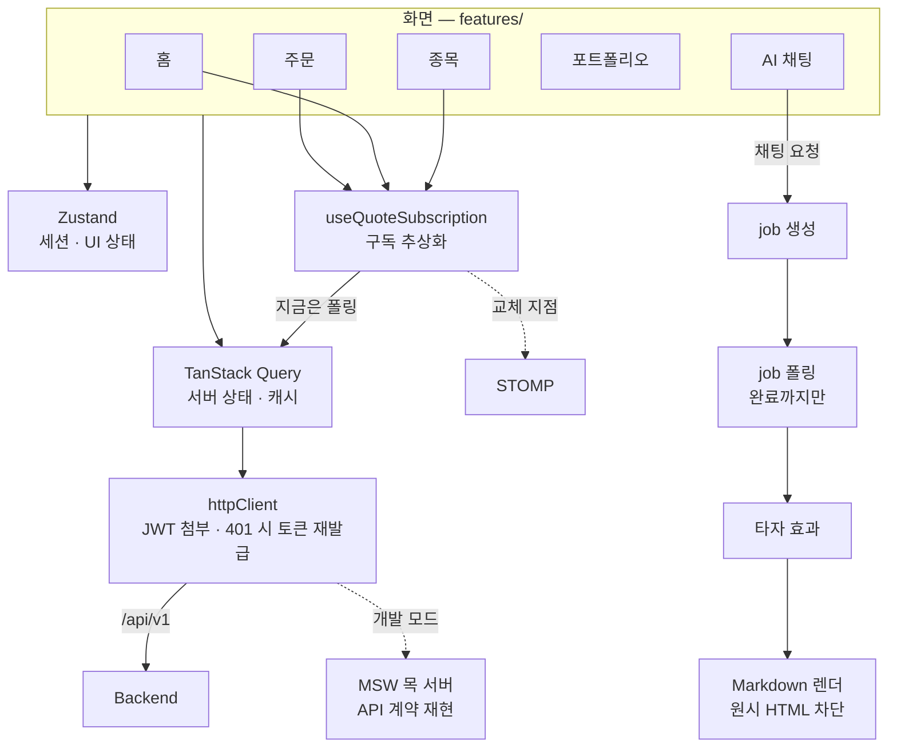

<div align="center">


[](https://finchapp.org)
[](https://github.com/Team-FINCH/finch-docs)
[](docs/finch-presentation.pdf)

</div>

## 📱 화면

|                    홈                     |              데일리 브리핑              |                  종목 상세                   |               AI 종목 분석                |
| :---------------------------------------: | :-------------------------------------: | :------------------------------------------: | :---------------------------------------: |
|         |   |           |     |
|            **주문 전 AI 점검**            |         **AI 포트폴리오 진단**          |               **수익률 분석**                |                **AI 채팅**                |
|  |  |  |  |

## ✨ 주요 기능

| 흐름        | 기능                   | 설명                                                                |
| ----------- | ---------------------- | ------------------------------------------------------------------- |
| 오늘의 시장 | **데일리 브리핑**      | 보유 종목 관련 소식을 추려 중요한 것부터 보여줌                     |
| 투자 판단   | **AI 종목 분석**       | 최근 1년 공시 + 최신 뉴스로 현재 상황·최근 변화·주목 요인·위험 정리 |
| 매매 실행   | **주문 전 AI 점검**    | 체결 뒤 종목·업종 비중 변화를 계산하고 기준 초과 항목 표시          |
| 계좌 관리   | **AI 포트폴리오 진단** | 위험도 점수(0–100)와 종목 집중도·업종 집중·변동성                   |
| 계좌 관리   | **수익률 분석**        | 기간 수익률을 시장 영향·업종 배분·종목 선택으로 분해                |
| 어디서나    | **AI 채팅**            | 보유 종목·거래 내역 기반 답변, 공시·뉴스 근거 표시                  |

## 🛠️ Tech Stack

<div align="center">


<br /><br />


</div>

| 분류           | 사용 기술                                      |
| -------------- | ---------------------------------------------- |
| 기반           | React 19 · TypeScript · Vite 8                 |
| 상태 관리      | TanStack Query · Zustand                       |
| 스타일 · UI    | Tailwind CSS 4 · Radix Primitives · Pretendard |
| 차트           | lightweight-charts                             |
| 검증 · 목 서버 | Zod · MSW                                      |
| AI 응답 렌더링 | react-markdown · remark-gfm                    |
| 앱 배포        | vite-plugin-pwa                                |

<details>
<summary><b>🧭 아키텍처</b></summary>
<br />



```
src/
├── app/        라우터 · 레이아웃 · 전역 Provider
├── features/   auth · home · stocks · order · portfolio · chat · deposit
│               transactions · inbox · onboarding · mypage
├── shared/     공용 UI · 타입 · API 계약
└── mocks/      MSW 핸들러
```

</details>

## 🧑🏻‍💻 Developers

|  |  |
| :-------------------------------------------------------: | :----------------------------------------------------: |
|                        **유승주**                         |                       **안서진**                       |
|         [@TrossYou](https://github.com/TrossYou)          |           [@xxj15](https://github.com/xxj15)           |
