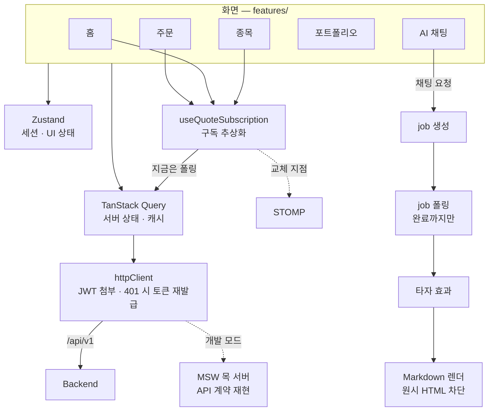

# FINCH Frontend

**AI 설명이 붙는 모바일 투자 앱** — [FINCH](https://github.com/Team-FINCH/finch-docs) 의 프론트엔드입니다.

[**finchapp.org**](https://finchapp.org) 에서 설치형 앱(PWA)으로 사용할 수 있습니다.


> 담당: 유승주 [@TrossYou](https://github.com/TrossYou) · 안서진 [@xxj15](https://github.com/xxj15)

## 아키텍처



**시세는 구독 추상화 뒤에 숨겼습니다.** 화면은 "이 종목을 구독한다"만 알고, 안쪽이 폴링인지 STOMP인지 모릅니다. 실시간 전송으로 바꿀 때 이 훅 하나만 고치면 됩니다.

**채팅은 비동기 작업입니다.** 요청하면 job 을 받고, 끝날 때까지만 상태를 조회합니다. 창이 백그라운드로 가면 조회를 멈춥니다.

## 화면

| 영역 | 내용 |
|---|---|
| 홈 | 데일리 브리핑, 수익률 원인 요약 |
| 종목 | 실시간 시세 차트, AI 종목 분석, 관심 종목 |
| 주문 | 시장가 매수·매도, 주문 전 AI 점검 |
| 포트폴리오 | 보유 현황, AI 진단 |
| AI 채팅 | 타자 효과, Markdown 렌더링, 근거 각주 |
| 온보딩 · 충전 · 거래내역 · 알림함 · 마이페이지 | |

## 이렇게 만들었습니다

- **백엔드 없이도 전 화면이 돕니다** — MSW 목 서버가 API 계약을 그대로 흉내 내서, 백엔드 개발과 병렬로 화면을 완성했습니다
- **API 계약을 타입으로 고정** — 응답·에러 코드를 공유 타입으로 정의해 계약 변경이 컴파일 오류로 드러납니다
- **AI 응답의 수치 강조** — AI 가 보낸 텍스트·수치 조각(`segments`)을 받아 수치만 따로 강조합니다
- **설치형 PWA** — 홈 화면 설치, 서비스 워커 캐시 전략

## 기술 스택

React 19 · TypeScript · Vite 8 · TanStack Query · Zustand · React Router 7 · Tailwind CSS 4 · lightweight-charts · react-markdown · MSW · vite-plugin-pwa

## 구조

```
src/
├── features/   auth · home · stocks · order · portfolio · chat · deposit
│               transactions · inbox · onboarding · mypage
├── shared/     공용 UI · 타입 · API 계약
└── mocks/      MSW 핸들러
```

## 실행

```bash
npm ci
npm run dev   # MSW 목 서버로 백엔드 없이 실행
```
