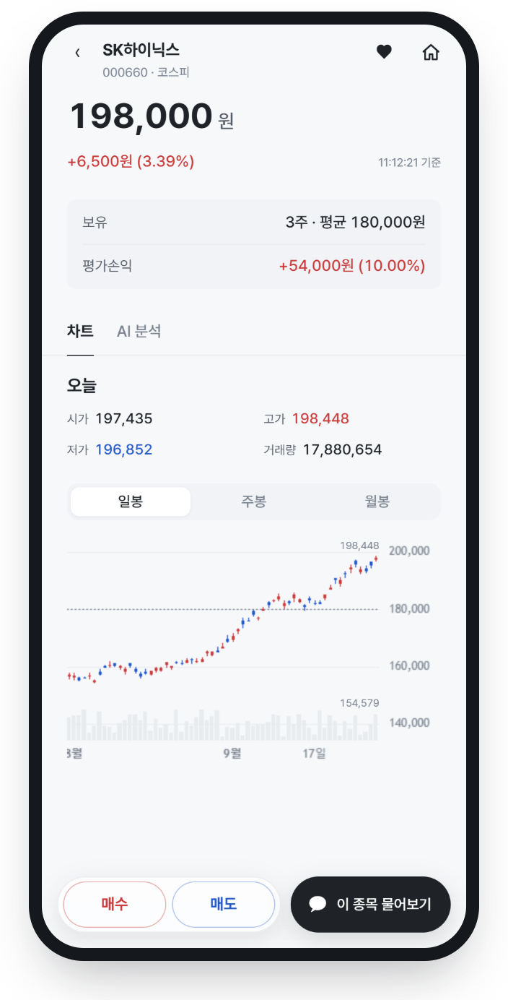
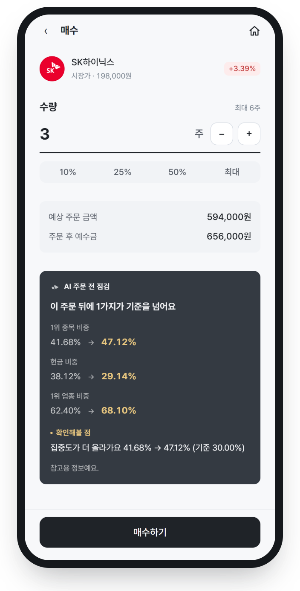
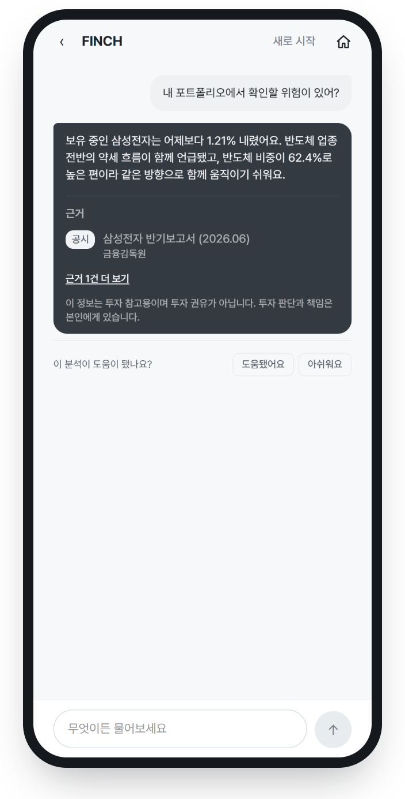
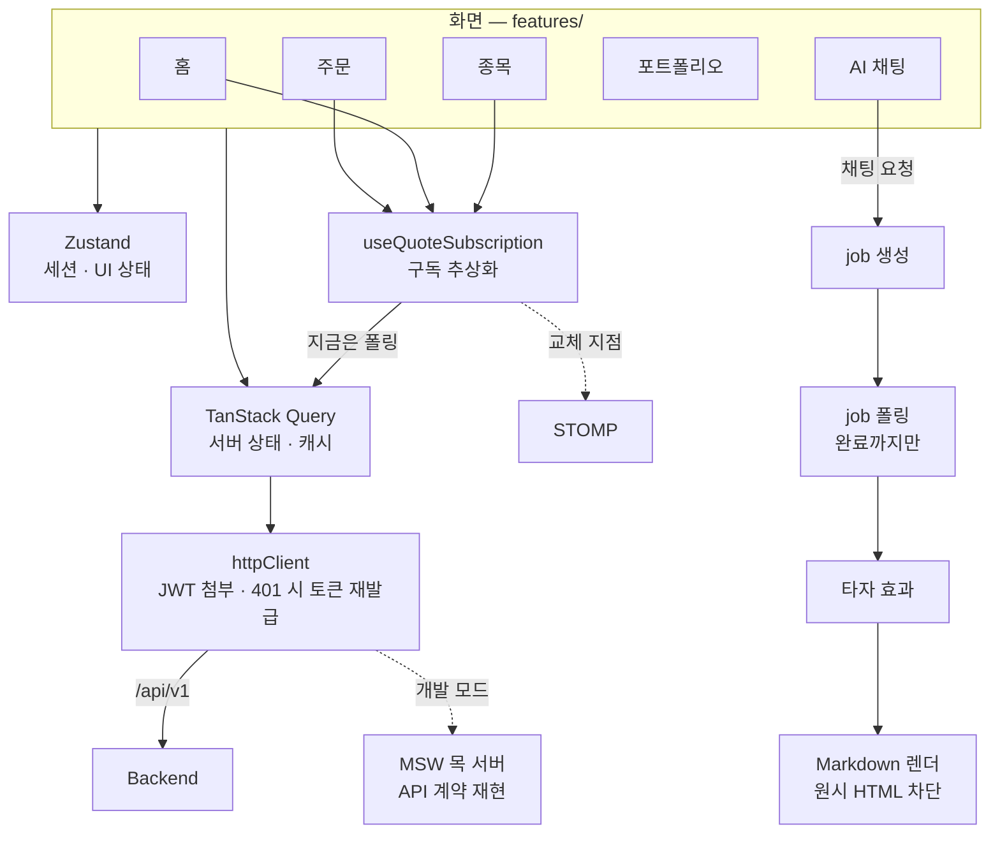

<div align="center">


[](https://finchapp.org)
[](https://github.com/Team-FINCH/finch-docs)
[](docs/finch-presentation.pdf)

</div>

## 📱 화면

|                    홈                     |              데일리 브리핑              |                  종목 상세                   |               AI 종목 분석                |
| :---------------------------------------: | :-------------------------------------: | :------------------------------------------: | :---------------------------------------: |
|         |   |           |     |
|            **주문 전 AI 점검**            |         **AI 포트폴리오 진단**          |               **수익률 분석**                |                **AI 채팅**                |
|  |  |  |  |

## ✨ 주요 기능

| 흐름        | 기능                   | 설명                                                                |
| ----------- | ---------------------- | ------------------------------------------------------------------- |
| 오늘의 시장 | **데일리 브리핑**      | 보유 종목 관련 소식을 추려 중요한 것부터 보여줌                     |
| 투자 판단   | **AI 종목 분석**       | 최근 1년 공시 + 최신 뉴스로 현재 상황·최근 변화·주목 요인·위험 정리 |
| 매매 실행   | **주문 전 AI 점검**    | 체결 뒤 종목·업종 비중 변화를 계산하고 기준 초과 항목 표시          |
| 계좌 관리   | **AI 포트폴리오 진단** | 위험도 점수(0–100)와 종목 집중도·업종 집중·변동성                   |
| 계좌 관리   | **수익률 분석**        | 기간 수익률을 시장 영향·업종 배분·종목 선택으로 분해                |
| 어디서나    | **AI 채팅**            | 보유 종목·거래 내역 기반 답변, 공시·뉴스 근거 표시                  |

## 🛠️ Tech Stack


<details>
<summary><b>📋 분류별로 보기</b></summary>
<br />

| 분류           | 사용 기술                                      |
| -------------- | ---------------------------------------------- |
| 기반           | React 19 · TypeScript · Vite 8                 |
| 상태 관리      | TanStack Query · Zustand                       |
| 라우팅         | React Router 7                                 |
| 스타일 · UI    | Tailwind CSS 4 · Radix Primitives · Pretendard |
| 차트           | lightweight-charts                             |
| 검증 · 목 서버 | Zod · MSW                                      |
| AI 응답 렌더링 | react-markdown · remark-gfm                    |
| 앱 배포        | vite-plugin-pwa                                |
| 코드 품질      | ESLint · Prettier                              |

</details>

<details>
<summary><b>🧭 아키텍처</b></summary>
<br />



```
src/
├── app/        라우터 · 레이아웃 · 전역 Provider
├── features/   auth · home · stocks · order · portfolio · chat · deposit
│               transactions · inbox · onboarding · mypage
├── shared/     공용 UI · 타입 · API 계약
└── mocks/      MSW 핸들러
```

</details>

## 🚀 실행

```bash
cp .env.example .env   # 목 서버(MSW)로 띄운다. 없으면 API 가 전부 실패한다
npm ci
npm run dev
```

`.env` 의 `VITE_ENABLE_MSW` 가 목 서버를 켜는 유일한 스위치다. **기본값은 꺼짐이라
변수를 주지 않으면 실제 백엔드로 요청이 나간다.** 목으로 띄우면 카카오 로그인이
실제 카카오를 거치지 않고 바로 로그인된 상태가 된다.

### Vercel 배포 (목 서버)

프레임워크 프리셋 `Vite`, 빌드 명령과 출력 폴더는 기본값 그대로 두고 **환경변수
하나만** 넣는다.

```
VITE_ENABLE_MSW = true
```

백엔드 주소·카카오 키·카카오 콘솔의 redirect URI 등록은 필요 없다. SPA 라우팅
폴백은 `vercel.json` 이 담고 있다. 목 모드에서는 PWA 서비스 워커를 만들지 않아
앱으로 설치되지는 않는다 — 목 워커가 같은 스코프를 써야 하기 때문이다.

대신 목 빌드는 **스스로를 지우는 `/sw.js`** 를 하나 내보낸다. 이 도메인을 전에
방문해 실배포 PWA 워커가 설치된 브라우저가, 갱신을 확인할 때 이것으로 교체되고
등록을 지운 뒤 목 앱으로 넘어온다. 이 파일이 없으면 그런 브라우저는 예전 화면에
갇힌 채 API 가 전부 실패한다.

### 빌드가 갈리는지 확인하는 법

**셸 환경변수로만 확인하지 않는다.** `vite.config.ts` 는 `loadEnv` 로 `.env` 와
셸 양쪽을 보지만, 한쪽으로만 재면 다른 쪽이 어긋나도 드러나지 않는다.

```bash
printf 'VITE_ENABLE_MSW=true
' > .env && npm run build
#  dist/sw.js          → 자기해제 스크립트 (registration.unregister 가 들어 있다)
#  dist/workbox-*.js   → 없다 (PWA 가 꺼졌다)
#  목 청크             → 있다

rm .env && npm run build
#  dist/sw.js          → 워크박스가 만든 진짜 PWA 워커
#  dist/workbox-*.js   → 있다
#  목 청크             → 없다 (트리셰이킹)
```

## 🧑🏻‍💻 Developers

|  |  |
| :-------------------------------------------------------: | :----------------------------------------------------: |
|                        **유승주**                         |                       **안서진**                       |
|         [@TrossYou](https://github.com/TrossYou)          |           [@xxj15](https://github.com/xxj15)           |
